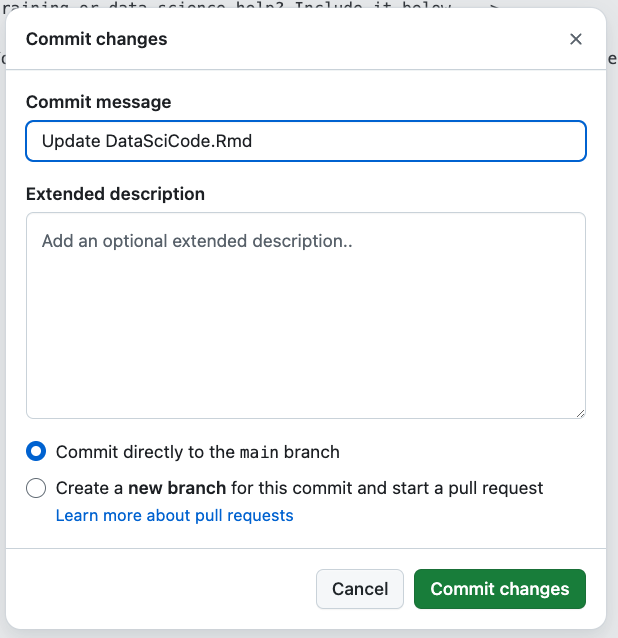

The following describes how to customise this workshop for your own institute.

#### Preparation - What do you need?

You do not need to download or install any special software (git or R) to customise this using this template. All of the steps can be done in your web browser. 

### How to copy the lessons

#### 1. Make a new Github account. 

You do need a Github account - https://docs.github.com/en/get-started/start-your-journey/creating-an-account-on-github should walk you through this. Please note, your username will form part of the URL for the workshop.

Now log in with your new details via https://github.com/login

#### 2. Let's copy (clone) the repository. 

Go to https://github.com/new?template_name=ReproducibleResearch&template_owner=amandamiotto . This is the page where we tell Github to make a copy of the lessons and save it into your own account. 

{alt='screenshot of the following details.'}

The repository template should be ***"amandamiotto/ReproducibleResearch"***.
***Include all branches*** should be ***unchecked***. 
***Owner*** should show your ***own user account name***.
***Repository name*** will be the other part of the URL, so you may want to label it something similar to ***"ReproducibilityCourse"***. Don't use spaces, but dashes are okay.
***Description*** should be meaningful.
***Public*** should be yes.

Now click "Create reposisitory" (the green button).

#### 3. Github will create a repository for you. 

It should look the same as https://github.com/amandamiotto/ReproducibleResearch but with your username and repository name.

{alt='screenshot of the following details.'}

We now need to wait 5-10 minutes for the website to built. You don't need to take any action, Github is doing the hard work for you.

You know it has been completed, when the following green tick appears.

{alt='Green tick'}

#### 4. Now we need to tell Github pages where to read the website details from. 

To do this, first we go into the Settings for the repository. It will be a Cog on the top menu.

{alt='Settings Cog'}

From here, we go into the Page setting.

{alt='Settings Cog'}

And change the branch that Github is looking for the webpages.

{alt='Settings Cog'}

***Source*** should be set to ***Deploy from a branch***

***Branch*** should be set to ***gh-pages*** and ***/(root)*** and press save.

Now we can go back to our repository by clicking "Code" at the top menu.

{alt='Code button in top menu'}

Your repository can also be found at the URL https://github.com/YOUR-USERNAME/YOUR-REPOSITORY-NAME.

It will take another 5 minutes for Github to rebuild the website from where we told it to. You can see when it is ready by watching for the ***green*** tick in Deployments (lower section of the right hand side menu). If it is still processing, it will be a yellow circle.

{alt='Showing green tick in deployment'}

#### 5. Now to get the website of our site!

An easy way to get the website for your repository is going through our "About" section. Click the ***cog*** next to ***About*** on the right hand panel.

{alt='Open About Settings'}

From here, click the box ***Use your GitHub Pages website*** to Yes. A website in the text box about should automatically be generated. This website will look like:

https://YOUR-USERNAME.github.io/YOUR-REPOSITORY-NAME/

Click "Save Changes".

{alt='as above, setting details.'}

We can now see our website link under "About". Click it!

Your website should now look identical to "https://amandamiotto.github.io/ReproducibleResearch/".

### 6. Customising for your institute

To add information that is relevant for your institute, there are a few files to edit. 

Let's go back to your main code repository page. 
https://github.com/YOUR-USERNAME/YOUR-REPOSITORY-NAME.

Click the folder ***Episodes***.

{alt='Click episodes'}

You can also find this page here: https://github.com/YOUR-USERNAME/YOUR-REPOSITORY-NAME/tree/main/episodes/files

Now click the folder "files".

{alt='Click Files'}

You should now see a row of files.

{alt='list of files in directory'}

Each of these files is a placeholder for you to include information relevant to your own organisation. You can leave them blank/unedited and the lesson content will still flow well.

To edit them, click the name of each file.

{alt='click a file name'}

Click the pen button to edit.

{alt='click a file name'}

Now you can add text in the text box. Each file has a comment, with a < ! - - to show the start of a comment and a - - > at the end of the comment. Comments marked like this are ignored by Github, and are more for the person reading the file (You).

Put any text you feel relevant under this comment, and it will appear in the lessons. Then click the green "Commit" button.

{alt='Text box'}

A Commit box comes up - press "Commit Change".

{alt='Text box'}

The change should now save. 

You can now continue to update all the files in the folder "files". It may take 5-10 minutes to update the webpage - again, you can look for the green tick on your repository https://github.com/YOUR-USERNAME/YOUR-REPOSITORY-NAME.

And you are done! All your custom information should now appear in your lessons.

#### 7. Optional step - Provide workshop details

If you would like to add some overarching information about your workshop, such as if it is virtual or in person, the location and link, you can edit the following file.

https://github.com/YOUR-USERNAME/YOUR-REPOSITORY-NAME/blob/main/learners/setup.md

This will appear at the bottom of your start page at https://YOUR-USERNAME.github.io/YOUR-REPOSITORY-NAME/

