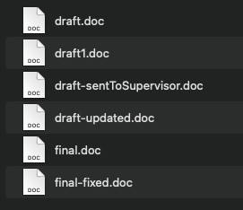
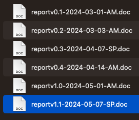

### Data Management Plan

A data management plan (DMP) is a living document for a research project, which outlines data creation, data policies, access and ownership rules, management practices, management facilities and equipment, and who will be responsible for what.

::::::::::::::::::::::::::::::::::::::::::::::: instructor

Does your institute have a Data Management policy, procedure or page that can be linked for your attendees?

This is a great place to put it!

Link to your institutional Data Management Planning Page

:::::::::::::::::::::::::::::::::::::::::::::::::::::::::::

<!-- This is where you can write information on your organisation's data management and data management plan webpage and support contacts. Replace the text below with anything you like, and it will appear in relevant places in the lessons. -->

Contact your institute's library or research office to find out more about data management and data management plans at your organisation.

The following resources can help you build your plan:

- [Aust Research Data Commons - Data Management Plans](https://ardc.edu.au/resource/data-management-plans/)

- [Elixir - What to include in your data management plan](https://rdmkit.elixir-europe.org/data_management_plan)

- [University of Oxford - DMP template examples](https://researchdata.ox.ac.uk/dmp-templates)

- [DCC - Example UK plans](https://www.dcc.ac.uk/resources/data-management-plans/guidance-examples)

- [Where can I find DMP templates?](https://www.youtube.com/watch?v=HooeSaj3dQM)

Around 50% of research projects reuse at least some of their previous project data - Is this data a subset of a previous project's data? Did it come from an external collaborator or an open repository? How does this affect your project?

### Folder Structures

Having your folders structured in a hierarchical format can be one of the best ways to stay organised.

There are benefits to this:

 - It is harder to lose files

 - When working with collaborators, it is easier to understand where everything is

 - If you need to go into your previous projects, you can quickly see where files are

While you can create your own folder templates, there are templates you can use:

[A simple example by the Turing Way project](https://the-turing-way.netlify.app/reproducible-research/compendia#basic-compendium)

[Project TIER](https://www.projecttier.org/tier-protocol/protocol-4-0/root/)

It is worth checking with your research group and local librarians if there is a pre-existing folder structure template that you can use.

Once your projects have finished, you may want to consider archiving your project folder.

#### Raw data

Keep a copy of your raw data backed up elsewhere, and never alter it. This means if you realise early in your work, there has been an error introduced into the data, you can retrieve a raw copy and reanalyse it.

::::::::::::::::::::::::::::::::::::::::::::::: instructor

This is a good time to talk about what research data storage options you have at your institute. Discuss backing up your data.

You may get a question on recovery verses backup - have a chat to your storage team who can assist you with understanding the differences.

:::::::::::::::::::::::::::::::::::::::::::::::::::::::::::

<!-- This is where you can write information on your organisation's data storage webpage and support contacts. Replace the text below with anything you like, and it will appear in relevant places in the lessons. -->

Ask your IT department about Research data storage and consider a backup plan.

***Don't forget - backups are your friend here. ***

### File naming conventions

There are a number of things to consider when naming files:

- Name folders in a meaningful way

- Don't use staff names

- Decide on a standard vocabulary across the research group and stick to it.  For example, will everyone call a location by Town name, town initials, postcode, state etc. 

- Instead of using 'Draft' in a filename, consider using version numbers. Your first version may be 1.0, so your filename may be ProjectReportv1.0 , then when someone edits it and sends it back, it may then become ProjectReportv1.1 .You could use a date and initials to mark it as well. So a report edited on 1st May 2024 by Amanda Miotto could be ProjectReportv1.1_20240501_AM

- Label any dates as YYYYMMDD . This can save confusion across international collaborators, and it makes it easier to search. We'll talk about this more in the next lesson.

There is an excellent list [of 13 rules for naming conventions](https://www.ed.ac.uk/records-management/guidance/records/practical-guidance/naming-conventions) worth the read.

#### Who is reading your file names?

##### Three principles for file names

There are three key principles to guide file naming convention development, as defined by Data Carpentry and Martinez (2015):

 - Machine readable

 - Human readable

 - Plays well with default ordering

Lets discuss each key principle below.

##### ***Machine readable***

Within the context of file naming conventions, being machine readable means:

 - Spaces have been avoided. Ideally there are no spaces in any file names.

 - Special characters are used in lieu of spaces i.e. _ or -

 - Case sensitivity is consistent

##### ***Human readable***

Ensuring your file naming convention is human readable will depend on the context, background knowledge of research user(s), and character spaces availability. In short, use descriptive words. There will be examples of this further below.

##### ***Plays well with default ordering***

Default ordering is best achieved with numbers. This can be chronological i.e. date, or logical i.e. 01, 02, 03…

Depending on the research and your teams preference, a common word could prefix the numeric ordering system. For example:

lake01_depth.r
lake02_depth.r
lake03_depth.r
so on….

:::::::::::::::::::::::::::::::::::::::::::::: challenge

##### Consider these two examples:

Consider this folder - does this feel organised? Are you sure what contains what? 

{alt='disorganised and poorly named files'}

How would you change this?

:::::::::::::::::::::::::::::::::::::::: solution

Now consider this folder - is it clear what the order is? Do you feel you could track this better?

{alt='well organised files'}

::::::::::::::::::::::::::::::::::::::::

::::::::::::::::::::::::::::::::::::::::::::::

#### Benefits

If implemented early and consistently, a standardised system or convention for naming files can:

 - Make file naming easier

 - Facilitate access, retrieval and storage of files

 - Make it faster to navigate files

 - Guard against misplacing or losing files

 - Assist with version control

 - Identify obsolete or duplicate records

 - Avoid backlogs or project delays by presenting a clear and real-time display of the current or completed work.

::::::::::::::::::::::::::::::::::::::::::::::: discussion

### Example of disorganised files and the retractions that can follow

A paper on pubpeer was revealed to have duplications in some of their images. When the authors were notified, they promptly investigated and found that their files were disorganised, causing duplication of images in place of originals. 

The authors retracted the paper.

K. Li, D. Li, C. Li, P. Zhuang, C. Dai, X. Hu, D. Wang, Y. Liu, X. Mei and V. M. Rotello, Nanoscale, 2022, 14, 3972 DOI: 10.1039/D2NR90041F or via this [link](https://pubs.rsc.org/en/content/articlelanding/2022/nr/d2nr90041f) licensed as CC-BY

::::::::::::::::::::::::::::::::::::::::::::::: 

### Metadata of your files

Are you collating photos, images, videos or other media? It is important to note information about each file alongside the files themselves.

The University of Chicago has [this useful guide to building a catalogue of information about your research images](https://vrc.uchicago.edu/guide-cataloging-your-images)

You could also look into a format such as [Dublin Core](https://en.wikipedia.org/wiki/Dublin_Core). Learn about [Dublin Core metadata basics](https://www.dublincore.org/resources/metadata-basics/).

Or you could use your own format, and cover simple metadata such as:

 - Publisher – "An entity responsible for making the resource available".

 - Rights – "Information about rights held in and over the resource, Copyright etc".

 - Source – "A related resource from which the described resource is derived. Where did this media come from?".

 - Subject – "The topic of the resource".

 - Title – "A name given to the resource".

# What is your next step?

::: tab 

### Beginner

A great place to start is:

 - Download a folder template and start using it!

 - Another idea is to put a copy of your raw data somewhere secure and backed up for safekeeping.

 - Come up with a plan on how you are going to name your files.

 - Check your folders are being backed up.

### Advanced

Your next move can be:

- Ensure all your projects are well organised. This could extend to projects across your research group.

 - Educate others in your space on good naming conventions and build a reference guide to be used across your group.

 - Get a metadata file set up for your media.

 - If you are working in Python, you can use a [python package](https://github.com/vukovicnikola/templateproject) developed by researcher Nikola Vukovic to generate a logical, standardised, and flexible directory hierarchy for academic research.

:::

::::::::::::::::::::::::::::::::::::::::::::::: discussion

## Further Resources

[The TIER Protocol](https://www.projecttier.org/tier-protocol/protocol-4-0/)

[File naming and folder structures by CESSDA](https://dmeg.cessda.eu/Data-Management-Expert-Guide/2.-Organise-Document/File-naming-and-folder-structure)

[Data Carpentry - Organization - File naming](https://datacarpentry.org/rr-organization1/01-file-naming/index.html)

:::::::::::::::::::::::::::::::::::::::::::::::::::::::::::

::::::::::::::::::::::::::::::::::::::::::::::: callout

## References

Data Management Plans | ARDC. (2022, May 14). Https://Ardc.edu.au/. Retrieved on 2024-05-03 at https://ardc.edu.au/resource/data-management-plans/, licenced as CC-BY

DCMI: Home. (2019). Dublincore.org. https://www.dublincore.org licenced under Creative Commons Attribution 4.0 International License 

Data Carpentry (2018) File Organization Retrieved on 2024-04-18 at https://datacarpentry.org/rr-organization1/01-file-naming/index.html licenced under CC BY 4.0 license.

Image:

Source: Carpentry, D. and Martinez, C. (2015) File organization: Naming, File Organization: File Organization: Naming. The Carpentries. Available at: https://datacarpentry.org/rr-organization1/01-file-naming/index.html (Accessed: January 24, 2023). licenced under CC BY 4.0 license

:::::::::::::::::::::::::::::::

::::::::::::::::::::::::::::::::::::::::::::::: keypoints

### In this lesson, we have learnt:

- How to plan our research by considering Data Management Plans and implementing a folder structure

- To keep a copy of raw data safe and secure separate to our working data

- How to consistantly name our files

- To consider and map the metadata of our files

#### We build trust in our knowledge by:

- Keeping our raw data safe and secure, so we can always come back to it and confirm our work

- Having consistant and standard operating procedures

#### We retain knowledge using:

- Having our files and folders organised, so nothing is lost

- Mapping the metadata of our files, so we know where they came from

#### We build business continuity by:

- Having our data and materials well organised, so others in our team can find data

- By being clear in our plans through Data Management Plans

:::::::::::::::::::::::::::::::::::::::::::::::
