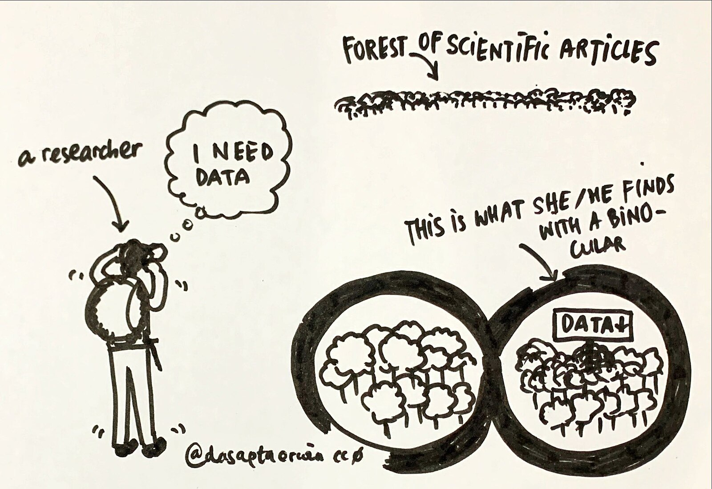

::::::::::::::::::::::::::::: objectives

- Understand the relationship between knowledge and trust
- Understand why reproducible research builds trust in our work

::::::::::::::::::::::::::::::::::::::::

We write research papers to contribute knowledge, insights, or perspectives to a field of study. By publishing a research output (for example, in a peer reviewed journal or a dataset), we ask our audience to believe in what we say, to accept that the knowledge we have created is true.

But how does our audience know this? A number of mechanisms are already in place to support this. Peer review, citations, acceptance into a reputable journal all add support into a paper. 

Another way we ensure our research credibility is reproducibility - can someone repeat your work and end up at the same conclusion? Knowledge should be reproducible. 

This also has the added benefit of encouraging reuse of the data and research methods - with research being a costly exercise, often at government (and general public) expense, producing quality results and enabling reuse is our responsibilty to the world. 

{alt='a person looking for data through binoculars'}

The digital age brings us both benefits and dangers. While we have the knowledge of the world at our fingertips, sifting through the buzz to find the knowledge is difficult and nuanced. With all the information on the internet and social media, how do people know what to trust?

Part of what we will talk about in these lessons is trust. How do we show that our research, the knowledge we have created, is trustworthy? 

Aligned to that, how do we retain this knowledge in the long term, so it can be trusted and reused in the future?

## The Reproducibility Crisis

::::::::::::::::::::::::::::::::::::: discussion

#### Nature paper - 1,500 scientists lift the lid on reproducibility

In the Nature paper "1,500 scientists lift the lid on reproducibility", researchers were surveyed about reproducibility.

 - Over 70% of researchers who had tried to replicate another researcher's experiments failed.

 - Over half had failed to reproduce their **own** experiments.

***These are not insignificant numbers.***

A number of interesting insights came from this study:

 - Half of researchers surveyed agreed that there was a significant crisis of reproducibility

 - almost 70% still trusted that even though these papers couldn't be reproduced, that the results were probably correct

:::::::::::::::::::::::::::::::::::::

Let's take another example. 

::::::::::::::::::::::::::::::::::::: discussion

#### The Reproducibility Project: Cancer Biology

The Reproducibility Project: Cancer Biology was an 8-year effort to replicate experiments from high-impact cancer biology papers published between 2010 and 2012. The project was a collaboration between the Center of Open Science and Science Exchange.

When preparing replications of 193 experiments from 53 papers there were a number of challenges that affected the project.

 - 2% of experiments had open data 

 - ***0% of protocols completely described***

 - 32% of experiments, the original authors were not helpful or unresponsive

 - 41% of experiments, the original authors were very helpful

:::::::::::::::::::::::::::::::::::::

Let's talk about this: 

On unresponsive authors, it's not always malicious:

* Authors do move institutes

* Can drop out of academia

* May be research students who didn't continue with research

* Data may have left with research students and supervisor may lack details or data on how the experiment was done

::::::::::::::::::::::::::::::::::::::::::::::: instructor

In my own experience (as @amandamiotto ) for a project where I had to contact researchers regarding moving their old data, a good third had left and either moved overseas and changed 2-3 institutes, were no longer in research or had names that were 'Australian-ised' or had changed for various reasons, meaning it was hard (and at times impossible) to track and find them. 

Lack of open data - this can be really specific to a field. Some health fields can't make their data open, and this statistic doesn't talk about what data could be FAIR or not published for commercial reasons.

:::::::::::::::::::::::::::::::::::::::::::::::::::::::::::

::::::::::::::::::::::::::::::::::::::::::::::: instructor

This is a good time to stop and ask people about their own knowledge and experiences. It gives you an opportunity to understand how much background your participants already have - if people have signed themselves for the class, they may have already been quite knowledgeable.

Questions you could ask are:

 - Do you know of other examples of reproduction studies?

 - Who here has tried to reproduce their own work?

 - Who here has tried to reproduce someone else's work?

 - What can these statistics tell us about these studies?

:::::::::::::::::::::::::::::::::::::::::::::::::::::::::::

## Factors contributing to the lack of reproducibility

- Difficulty in managing complex datasets or poor statistical practices

- Poor research design, including a failure to control for bias

- A lack of access or detail of the methodology used

- A lack of access to raw data and research materials

- A culture of 'Publish or Perish' mentality, that only rewards novel findings

- Difficulty or lack of publishing negative results

## Suggested changes to improve reproducibility across the industry

- Preregistration of experiments

- Full and detailed documentation and publication of methods 

- Training on statistical models and study design

- Openly or [FAIR](https://ardc.edu.au/resource/fair-data/) sharing of data, materials and software

- Publishing preprints

- Open access  

- Publish negative results

- Conduct and publish replication and validation studies

### What is happening on the global scale

[UKRN](https://www.ukrn.org/) is the UK Reproducibility Network

[AUS-RN](https://www.aus-rn.org/aus-rn-events) is the Australian Reproducibility network.

[ReproducibiliTEA](https://reproducibilitea.org/) - A grassroots journal club initiative, focusing on open science, ideas on improving science and reproducibility.

#### What can we change?

While all of these are relevant and valid, there are some things we can't change today. But we can change our own behaviours and activities. The next lessons focus on what we can change in our everyday work.

::::::::::::::::::::::::::::::::::::::::::::::: testimonial

### How this can benefit you?

Working reproducibly has many benefits for the research ecosystem. However, there are also direct benefits for yourself.

Florian Markowetz listed these "five selfish reasons to work reproducibly":

1. Reproducibility helps to avoid disaster

2. Reproducibility makes it easier to write papers

3. Reproducibility helps reviewers see it your way

4. Reproducibility enables continuity of your work

5. Reproducibility helps to build your reputation

Markowetz, F. Five selfish reasons to work reproducibly. Genome Biol 16, 274 (2015). https://doi.org/10.1186/s13059-015-0850-7 licenced as CC-BY 4.0

::::::::::::::::::::::::::::::::::::::::::::::: 

::::::::::::::::::::::::::::::::::::::::::::::: discussion

## Useful Resources

Wikipedia contributors. (2024, March 24). Replication crisis. In Wikipedia, The Free Encyclopedia. Retrieved 02:26, April 4, 2024, from https://en.wikipedia.org/w/index.php?title=Replication_crisis&oldid=1215379059 as Creative Commons Attribution-ShareAlike License

::::::::::::::::::::::::::::::::::::::::::::::: 

::::::::::::::::::::::::::::::::::::::::::::::: callout

## Paper References resources

Baker, M. 1,500 scientists lift the lid on reproducibility. Nature 533, 452–454 (2016). Retrieved on 2024-04-04 https://doi.org/10.1038/533452a

Center for Open Science. "Reproducibility Project: Cancer Biology" (2021). Retrieved 2024-5-8 from https://www.cos.io/rpcb. licenced as CC-BY

American Type Culture Collection (ATCC) Six factors affecting reproducibility in life science research and how to handle them . Nature Articles Retrieved 2024-5-8 from https://www.nature.com/articles/d42473-019-00004-y. 

### Referenced in text

Center for Open Science. "Reproducibility Project: Cancer Biology" (2021). Retrieved 2024-5-8 from https://www.cos.io/rpcb. licenced as CC-BY

Morton, L (2022, July 12). 5 Open Science practices that improve reproducibility & support trust in science. The Official PLOS Blog. Retrieved 2024-5-8 from https://theplosblog.plos.org/2022/07/reproducibility licenced as CC-BY

Munafò, M., Nosek, B., Bishop, D. et al. A manifesto for reproducible science. Nat Hum Behav 1, 0021 (2017). https://doi.org/10.1038/s41562-016-0021 licenced as Creative Commons Attribution 4.0 International License

Image:

WikiMedia (2021) Dasaptaerwin Data-sharing.jpg. Retrieved 2024-04-19 from https://commons.wikimedia.org/wiki/File:Data-sharing.jpg licenced as Creative Commons CC0 License (Public Domain) 

:::::::::::::::::::::::::::::::::::::::::::::::::::::::::::

::::::::::::::::::::::::::::::::::::::::::::::: instructor

The Nature paper has some excellent graphics that you may like reference in your internal training, however due to copyright, we have decided to not use it here.

:::::::::::::::::::::::::::::::::::::::::::::::::::::::::::

::::::::::::::::::::::::::::::::::::::::::::::: keypoints

In this lesson, we have learnt:

- About the reproducibility crisis

- How reproducibility can be improved broadly

- How by changing our work to be more reproducible, it can also benefit ourselves

:::::::::::::::::::::::::::::::::::::::::::::::

